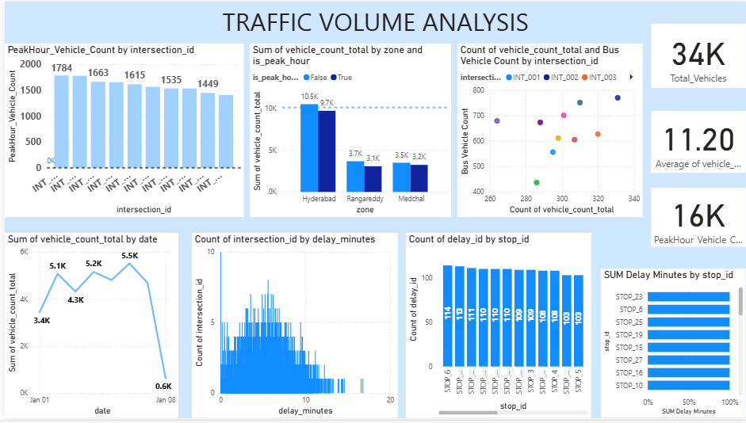

# 🚦 Traffic Volume Analysis for Intersection-Level Insights  

## 📌 Project Overview  
This project focuses on analyzing traffic volume, public transport delays, and signal timing data to generate actionable insights for improving urban traffic management.

The objective is to reduce congestion, optimize signal timings, and enhance public transport efficiency using Python, SQL, and Power BI.

---

## 📊 Dashboard Preview  



---

## 📂 Dataset  

This project uses three datasets:

- Public Transport Delay Log  
- Signal Timing Configuration  
- Traffic Volume Log  

These datasets were integrated to build a comprehensive traffic analysis system.

---

## 🧠 Python Analysis  

Python was used for data preprocessing and analysis:

### 🔹 Data Preprocessing  
- Handling missing values  
- Removing duplicates  
- Datatype conversion (timestamps)  
- Outlier treatment using IQR method  

### 🔹 Exploratory Data Analysis (EDA)  
- Mean, Median, Mode  
- Variance & Standard Deviation  
- Skewness & Kurtosis  
- Histogram, Boxplot, Q-Q Plot  

### 🔹 Feature Engineering  
- Peak hour identification  
- Delay categorization  
- Dataset merging  

---

## 📈 Power BI Dashboard  

An interactive dashboard was developed to visualize:

- Traffic volume trends  
- Public transport delays  
- Peak hour congestion  
- Intersection performance  
- Vehicle distribution  

---

## 🧰 Technologies Used  

- Python (Pandas, NumPy, Matplotlib, Seaborn)  
- MySQL  
- SQLAlchemy  
- Power BI  

---

## 📊 Key Insights  

- Peak hours have the highest traffic congestion  
- Delays are mainly caused by signal inefficiencies and breakdowns  
- Some intersections consistently show high delays  
- Traffic volume directly impacts transport delays  
- Signal optimization can reduce congestion  

---

## 🚀 How to Run the Project

### Clone repository
```bash
git clone https://github.com/yourusername/customer-360-retail-analysis.git
```

### Install dependencies
```bash
pip install -r requirements.txt
```

### Run SQL file
```sql
SQL.sql
```

### Open Power BI file
```text
power bi file.pbix
```
## 📅 Weekly Project Progress  

- Week 1 → Data Collection & Understanding  
- Week 2 → Data Cleaning & Preprocessing  
- Week 3 → Python EDA & SQL Integration  
- Week 4 → Power BI Dashboard Development  

---

## 🏗️ Project Architecture

-Raw CSV Data

-Python (Data Cleaning & EDA) 

-MySQL Database 

-SQL Analysis 

-Power BI Dashboard

## 🔄 Project Pipeline

-Traffic Dataset

-Data Preprocessing (Python) 

-Database Storage (MySQL) 

-Data Analysis (SQL) 

-Visualization (Power BI)

## 📌 Tags

Data Analytics | Python | SQL | Power BI 
